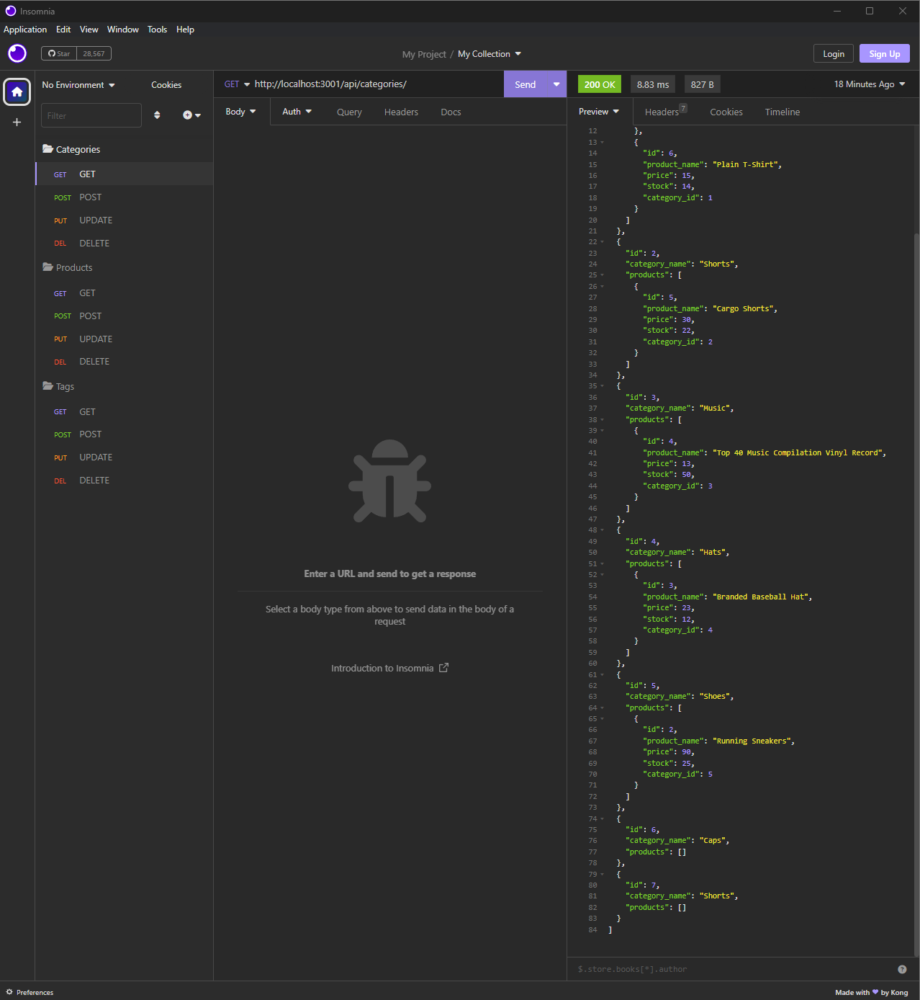

# E-Commerce Back End

## Description
This application is an e-commerce backend which can create, read, update, and delete categories, products, and tags from a database. This application utilizes [MySQL](https://dev.mysql.com/downloads/mysql/), [Sequelize](https://sequelize.org/), [Express.js](https://expressjs.com/), and [dotenv](https://www.npmjs.com/package/dotenv) in order to function.

## Table of Contents
- [Mockup](#mockup)
- [Installation](#installation)
- [Usage](#usage)
- [License](#license)
- [Contributing](#contributing)
- [Tests](#tests)
- [GitHub](#github)
- [Email](#email)
- [Instructions](#instructions)

## Mockup

## Installation
You will install node.js using the command line. [MySQL](https://dev.mysql.com/downloads/mysql/) will need to be downloaded on your local computer. You will also need to download the necessary node_modules using "npm install" prior to setting up the database. Additionally, you will need a way to perform CRUD operations on the database, such as using the application Insomnia.

## Usage
Start the database by logging into [MySQL](https://dev.mysql.com/downloads/mysql/) and using command "source db/schema.sql";. After this,seed the table with your categories/products/tags using the phrase "npm run seed". You will be able to update your e-commerce database using [Insomnia](https://insomnia.rest/download). 

## License
MIT

## Contributing
If you would like to contribute to this application, please send me an email to discuss adding to it.

## Tests
There are currently no tests for this application.

## GitHub
GitHub: https://github.com/caitlinramsey

## Email
Email: caitlinramsey@outlook.com

## Instructions 
Please email me with any questions.

## Walkthrough Video